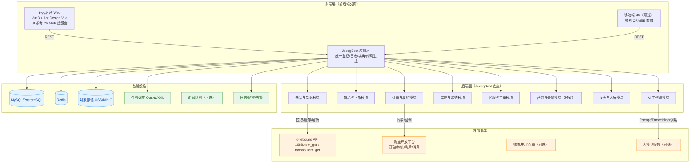
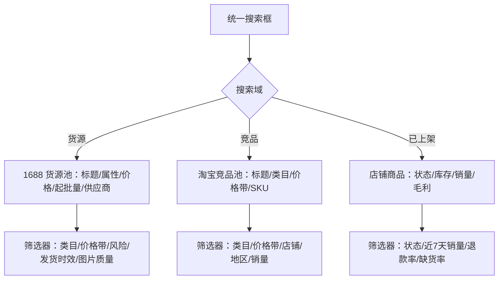
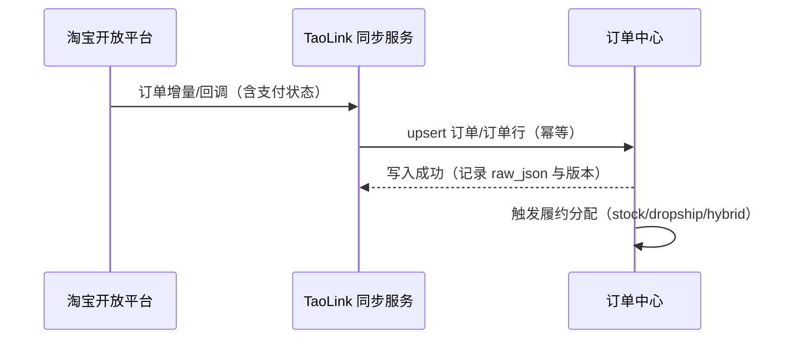
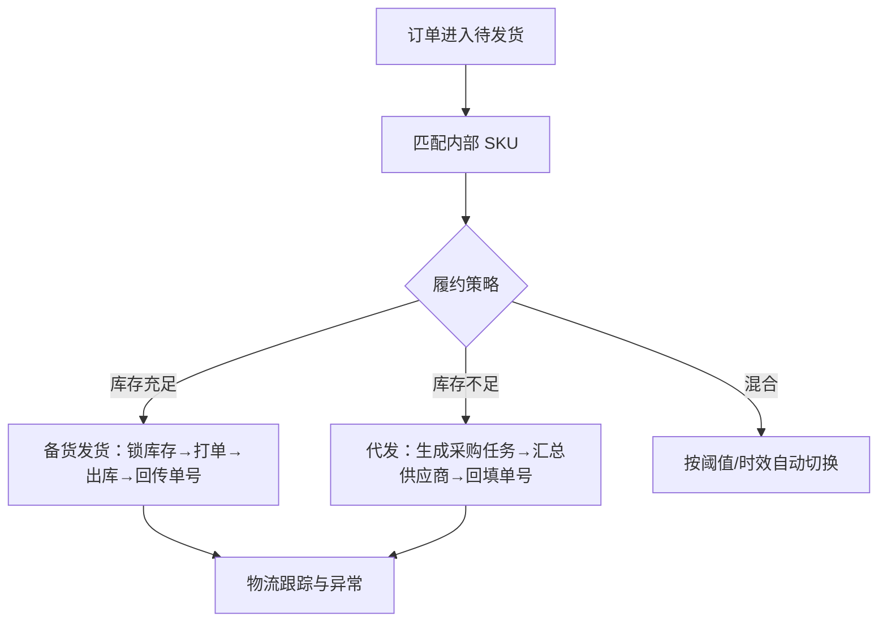
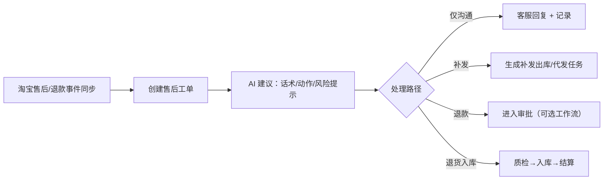
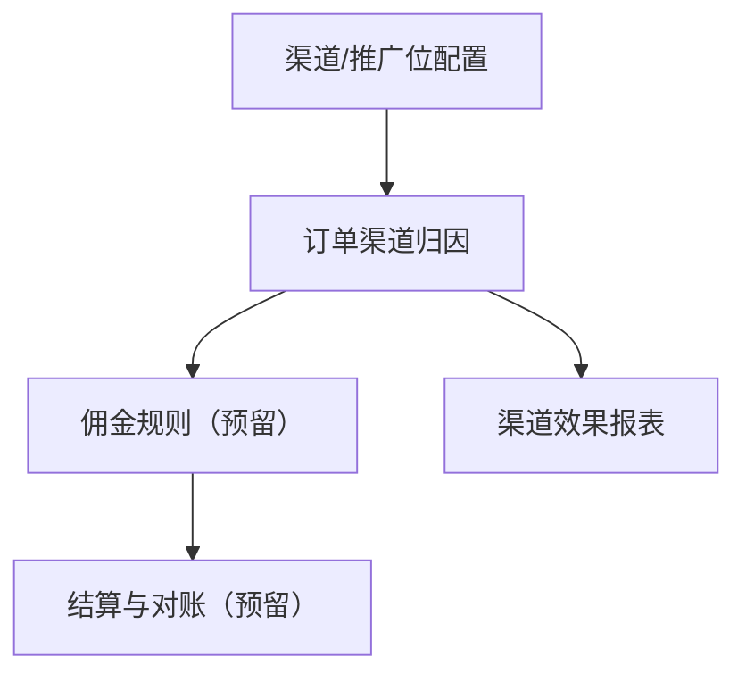
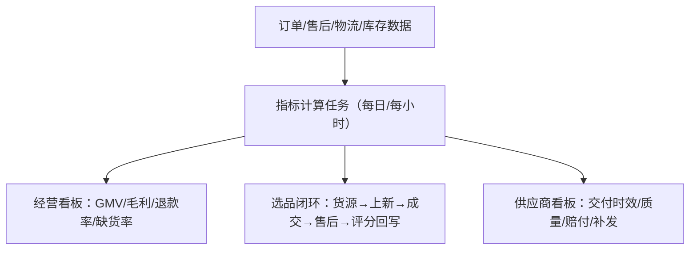

# 《产品设计文档》TaoLink（1688选品混合履约 + 淘宝单平台运营）

- 产品代号：TaoLink
- 文档版本：0.1.0
- 状态：Draft（评审通过后方可进入研发阶段）
- 技术底座：JeecgBoot（前后端分离、RBAC、代码生成、在线表单/报表/流程、任务调度）
- UI 参考：CRMEB（商品展示、购物车、订单、会员、营销、后台运营的交互模式与视觉规范）
- 业务规划依据：[one_person_taobao_1688_plan.md](file:///d:/github_repo/AITaoLink/one_person_taobao_1688_plan.md)

---

## 目录

- [1. 项目背景与目标](#1-项目背景与目标)
  - [1.1 背景](#11-背景)
  - [1.2 商业目标与指标（对齐规划文档）](#12-商业目标与指标对齐规划文档)
  - [1.3 产品范围与边界](#13-产品范围与边界)
  - [1.4 术语与缩写](#14-术语与缩写)
- [2. 总体架构](#2-总体架构)
  - [2.1 架构原则](#21-架构原则)
  - [2.2 总体架构图（含 JeecgBoot 集成点）](#22-总体架构图含-jeecgboot-集成点)
  - [2.3 JeecgBoot 集成点清单](#23-jeecgboot-集成点清单)
  - [2.4 模块边界（服务/子模块）](#24-模块边界服务子模块)
- [3. 核心业务流程](#3-核心业务流程)
  - [3.1 商品发布（1688→内容包→淘宝上架）](#31-商品发布1688内容包淘宝上架)
  - [3.2 搜索（货源/竞品/已上架）](#32-搜索货源竞品已上架)
  - [3.3 下单与支付（淘宝交易侧同步）](#33-下单与支付淘宝交易侧同步)
  - [3.4 履约（备货/代发/混合）](#34-履约备货代发混合)
  - [3.5 售后（退款/退货/补发）](#35-售后退款退货补发)
  - [3.6 分销（以淘宝客/推广位为主，预留独立分销）](#36-分销以淘宝客推广位为主预留独立分销)
  - [3.7 数据报表（经营/履约/选品闭环）](#37-数据报表经营履约选品闭环)
  - [3.8 关键状态机](#38-关键状态机)
- [4. 功能清单与优先级（迭代排期）](#4-功能清单与优先级迭代排期)
  - [4.1 迭代策略](#41-迭代策略)
  - [4.2 功能清单（高/中/低）](#42-功能清单高中低)
- [5. 角色与权限矩阵（JeecgBoot RBAC 扩展）](#5-角色与权限矩阵jeecgboot-rbac-扩展)
  - [5.1 角色定义](#51-角色定义)
  - [5.2 权限模型与数据权限](#52-权限模型与数据权限)
  - [5.3 权限矩阵](#53-权限矩阵)
- [6. 页面信息架构（IA）与导航系统](#6-页面信息架构ia与导航系统)
  - [6.1 后台（桌面端）IA](#61-后台桌面端-ia)
  - [6.2 移动端（H5 风格，参考 CRMEB）IA](#62-移动端h5-风格参考-crmeb-ia)
  - [6.3 导航与权限联动](#63-导航与权限联动)
- [7. 高保真原型规范（桌面端 + 移动端）](#7-高保真原型规范桌面端--移动端)
  - [7.1 视觉规范（对齐 CRMEB）](#71-视觉规范对齐-crmeb)
  - [7.2 组件库与页面栅格](#72-组件库与页面栅格)
  - [7.3 关键页面原型（桌面端）](#73-关键页面原型桌面端)
  - [7.4 关键页面原型（移动端）](#74-关键页面原型移动端)
- [8. 交互说明（加载/空态/错误/埋点）](#8-交互说明加载空态错误埋点)
  - [8.1 通用交互规范](#81-通用交互规范)
  - [8.2 空态与错误提示](#82-空态与错误提示)
  - [8.3 埋点事件规范](#83-埋点事件规范)
- [9. 数据模型与接口约定](#9-数据模型与接口约定)
  - [9.1 命名与字段规范](#91-命名与字段规范)
  - [9.2 分页/排序/过滤约定（对齐 JeecgBoot）](#92-分页排序过滤约定对齐-jeecgboot)
  - [9.3 统一返回结构](#93-统一返回结构)
  - [9.4 核心数据模型（字段/类型/校验/枚举）](#94-核心数据模型字段类型校验枚举)
  - [9.5 核心接口清单（REST）](#95-核心接口清单rest)
- [10. 非功能性需求](#10-非功能性需求)
  - [10.1 性能](#101-性能)
  - [10.2 安全](#102-安全)
  - [10.3 可用性](#103-可用性)
  - [10.4 扩展性](#104-扩展性)
  - [10.5 可维护性](#105-可维护性)
- [11. 测试策略](#11-测试策略)
- [12. 上线与回滚方案](#12-上线与回滚方案)
- [13. 里程碑与交付物清单](#13-里程碑与交付物清单)
  - [13.1 里程碑（Alpha/Beta/RC/GA）](#131-里程碑alphabetarcga)
  - [13.2 交付物清单](#132-交付物清单)
  - [13.3 评审与准入门槛](#133-评审与准入门槛)
- [附录 A：与规划文档的映射](#附录-a与规划文档的映射)
  - [A.1 本期聚焦与不做清单](#a1-本期聚焦与不做清单)
  - [A.2 风险与假设](#a2-风险与假设)
- [变更记录](#变更记录)

---

## 1. 项目背景与目标

### 1.1 背景

一人公司在淘宝运营中面临的核心矛盾是“人力有限 vs. 选品/上新/履约/客服/复盘全链路工作量大”。本项目以“1688 选货（代发+备货混合）+ 淘宝单平台”为边界，通过 JeecgBoot 提供的工程化底座与低代码/代码生成能力，快速构建一套可持续迭代的运营系统，并在 UI 交互上全面借鉴 CRMEB 的成熟商城体验，降低学习成本与操作成本。

### 1.2 商业目标与指标（对齐规划文档）

指标以“运营闭环效率”为主，兼顾规模化增长的可扩展性：

- 选品效率：日常候选池自动化产出，人工审核收敛到 Top-N。
- 上新效率：基于 1688 商品素材自动生成“上新内容包”，减少重复编辑。
- 履约稳定：库存优先、代发兜底，发货时效可控，异常可追溯。
- 客服减负：高频问题自动化，复杂问题工单化并给出 AI 建议。
- 闭环复盘：成交、退款、物流异常、差评等指标可追踪到“货源/商品/环节”并反哺选品与备货。

### 1.3 产品范围与边界

范围分为两条主线：

- 运营主线（本项目核心）：1688 货源→内容包→淘宝上架→订单同步→履约→售后/客服→报表。
- 商城主线（UI 与交互借鉴 CRMEB，能力按优先级分期）：商品展示/搜索、购物车、下单、支付、会员中心、营销组件。

边界说明（避免目标漂移）：

- 淘宝“支付/收款”不由本系统承载，仅同步订单支付状态与流水摘要（以官方开放平台为准）。
- onebound 主要用于“商品信息采集”与“竞品对标”；订单/售后等交易能力以官方开放平台为主。

### 1.4 术语与缩写

- SPU：标准产品单元（商品）
- SKU：库存单位（规格）
- 货源：1688 offer
- Listing：淘宝上架商品（你店铺的商品）
- RBAC：基于角色的访问控制（JeecgBoot 权限模型）
- IA：信息架构（导航与页面结构）
- TPS：每秒事务处理量

---

## 2. 总体架构

### 2.1 架构原则

- 先闭环再增强：先跑通选品-上新-订单-履约-售后-报表，再逐步引入更自动化能力。
- 统一模型：onebound/淘宝开放平台的异构数据统一落到内部领域模型，避免“接口绑死业务”。
- 权限先行：按 JeecgBoot RBAC 落地菜单/按钮/数据权限，确保可运营、可审计。
- 可观测与可追溯：每个关键动作可追溯来源数据、规则版本与操作人。

### 2.2 总体架构图（含 JeecgBoot 集成点）



### 2.3 JeecgBoot 集成点清单

- 权限体系：菜单权限、按钮权限、数据权限（部门/角色/自定义规则）。
- 代码生成：基于表结构生成 CRUD（后端 Controller/Service/Mapper + 前端列表/表单 + SQL）。
- 字典与枚举：sys_dict / sys_category 管理业务枚举、类目树、标签体系。
- 在线表单/报表：用于快速搭建运营录入与报表（可逐步替换为定制页面）。
- 工作流（可选）：用于采购审批、售后审批、补偿审批等流程。
- 任务调度：同步订单、拉取物流、重算评分、生成日报/周报。
- 系统能力：操作日志、数据日志、异常告警、接口限流与审计。

### 2.4 模块边界（服务/子模块）

建议以“单体多模块”起步，后续按压力拆分服务：

- 选品与货源：货源池、抓取、解析、评分、风险库、素材管理。
- 商品与上架：SPU/SKU、内容包、上架草稿、上架记录、价格策略。
- 订单与履约：订单同步、履约分配、发货回传、物流跟踪、异常。
- 库存与采购：仓库、库存台账、采购单、入库、出库、补货建议。
- 客服与工单：工单中心、话术库、自动分流、SLA、质检。
- 营销与分销：优惠券/活动/分销体系（预留；淘宝单平台可先对接淘宝客数据）。
- 报表与大屏：经营、履约、售后、供应商表现、选品闭环。
- AI 工作流：运行记录、提示词版本、知识库（FAQ/政策/素材）、工具调用审计。

---

## 3. 核心业务流程

### 3.1 商品发布（1688→内容包→淘宝上架）


关键规则：

- 任何“合规风险/侵权风险高”的商品强制进入人工审核且不可一键发布。
- 内容包需要保留版本与生成依据（可追溯到 1688 raw_json 与 AI runId）。

### 3.2 搜索（货源/竞品/已上架）



### 3.3 下单与支付（淘宝交易侧同步）

说明：

- 下单与支付发生在淘宝侧，本系统仅同步订单生命周期与支付结果，用于履约与报表。



### 3.4 履约（备货/代发/混合）



### 3.5 售后（退款/退货/补发）



### 3.6 分销（以淘宝客/推广位为主，预留独立分销）

范围建议：

- 本期：接入淘宝客/推广位数据（若可获取），做“渠道效果报表”。
- 预留：CRMEB 式分销体系（分销员、分销订单、佣金结算）作为低优先级扩展。



### 3.7 数据报表（经营/履约/选品闭环）



### 3.8 关键状态机

#### 3.8.1 订单状态（内部）

- CREATED：已同步订单
- PAID：已支付（淘宝侧确认）
- TO_SHIP：待发货
- SHIPPED：已发货
- DELIVERED：已签收/确认收货
- CLOSED：交易关闭
- AFTERSALE：售后中（并行态，可与 SHIPPED/DELIVERED 关联）

#### 3.8.2 履约状态（订单行）

- UNASSIGNED：未分配
- STOCK_RESERVED：已锁库
- DROPSHIP_PURCHASE_CREATED：已生成代发采购任务
- SHIPMENT_CREATED：已生成运单/待揽收
- IN_TRANSIT：运输中
- EXCEPTION：异常
- DONE：履约完成

---

## 4. 功能清单与优先级（迭代排期）

### 4.1 迭代策略

- P0（高）：闭环必需，影响下单→发货→售后→报表的可用性。
- P1（中）：明显提升效率与体验，但不阻断闭环。
- P2（低）：锦上添花或为未来扩展预埋。

### 4.2 功能清单（高/中/低）

| 模块 | 功能点 | 优先级 | 迭代建议 |
|---|---|---:|---|
| 货源池 | 1688 货源详情采集（item_get）、原始回包存档、去重 | 高 | Iter-1 |
| 货源池 | 货源搜索/筛选（类目/价格/起批量/图片数/风险标签） | 高 | Iter-1 |
| 选品评分 | 规则评分（毛利红线/风险/时效）+ 可配置阈值 | 高 | Iter-1 |
| 选品评分 | AI 摘要（卖点/风险点/建议履约模式）+ 版本记录 | 高 | Iter-1 |
| 内容包 | 标题/卖点/详情结构/FAQ 自动生成与编辑 | 高 | Iter-1 |
| 上架 | 上架草稿管理、审核流（通过/退回） | 高 | Iter-1 |
| 上架 | 淘宝商品发布（接口或人工发布记录） | 中 | Iter-2 |
| 订单中心 | 淘宝订单同步（增量+幂等）、订单行映射内部 SKU | 高 | Iter-1 |
| 履约 | 自动履约分配（stock/dropship/hybrid）、阈值策略 | 高 | Iter-1 |
| 库存 | 仓库/库存台账、锁库/释放、出入库流水 | 高 | Iter-1 |
| 采购 | 代发采购任务生成、按供应商汇总、回填单号 | 高 | Iter-1 |
| 物流 | 运单信息回填、物流轨迹同步、停滞异常规则 | 中 | Iter-2 |
| 客服 | 工单中心（催发/退款/少件/质量/差评）+ SLA | 高 | Iter-1 |
| 客服 | AI 话术草稿、禁承诺提示、知识库（政策/FAQ） | 中 | Iter-2 |
| 报表 | 经营看板（GMV/毛利/退款率/缺货率/时效） | 高 | Iter-1 |
| 报表 | 供应商看板、选品闭环回写评分 | 中 | Iter-2 |
| 营销 | 优惠券/满减/秒杀（CRMEB 模式） | 低 | Iter-3 |
| 分销 | 分销员/佣金/结算（CRMEB 模式） | 低 | Iter-3 |
| 商城前台（H5） | 商品展示/购物车/下单/支付（独立商城） | 低 | Iter-3（或不做） |

注：若坚持“淘宝单平台且不自建商城前台”，则“购物车/下单/支付（前台）”作为低优先级或不做清单；相关流程以“淘宝侧同步”替代。

---

## 5. 角色与权限矩阵（JeecgBoot RBAC 扩展）

### 5.1 角色定义

- 超级管理员：系统配置、权限、审计、全量数据。
- 运营负责人：看板、策略阈值、上新审核、营销（如启用）。
- 选品专员：货源池、选品评分、内容包生成与编辑。
- 上架专员：上架草稿、发布记录、价格策略。
- 仓储/发货：库存、出库、补发、运单回填。
- 采购：采购任务、供应商管理、到货入库。
- 客服：工单处理、话术库、售后跟进。
- 财务：对账、毛利核算、补偿审批（如启用）。
- 数据分析：报表查看、导出、指标配置（只读为主）。
- 审计员：操作日志、数据变更日志、导出审计。

### 5.2 权限模型与数据权限

继承 JeecgBoot RBAC：

- 菜单权限：控制模块入口可见性。
- 按钮权限：控制操作粒度（新增/编辑/删除/审核/导出/回填单号等）。
- 数据权限：
  - 组织维度：按部门/店铺/仓库做数据隔离。
  - 业务维度：按供应商、类目、品牌风险等级、订单金额分级。

### 5.3 权限矩阵

| 模块 | 功能点 | 超管 | 运营负责人 | 选品 | 上架 | 仓储 | 采购 | 客服 | 财务 | 分析 | 审计 |
|---|---|:--:|:--:|:--:|:--:|:--:|:--:|:--:|:--:|:--:|:--:|
| 货源池 | 查看/搜索 | ✔ | ✔ | ✔ | ✔ | - | ✔ | - | - | ✔ | ✔ |
| 货源池 | 采集/刷新 | ✔ | ✔ | ✔ | - | - | ✔ | - | - | - | ✔ |
| 选品评分 | 调整阈值 | ✔ | ✔ | - | - | - | - | - | ✔ | ✔ | ✔ |
| 内容包 | 生成/编辑 | ✔ | ✔ | ✔ | ✔ | - | - | - | - | - | ✔ |
| 上架 | 审核通过/退回 | ✔ | ✔ | - | ✔ | - | - | - | - | - | ✔ |
| 订单 | 查看/导出 | ✔ | ✔ | ✔ | ✔ | ✔ | ✔ | ✔ | ✔ | ✔ | ✔ |
| 履约 | 分配/改履约模式 | ✔ | ✔ | - | ✔ | ✔ | ✔ | - | - | - | ✔ |
| 库存 | 入库/出库/调整 | ✔ | ✔ | - | - | ✔ | ✔ | - | - | ✔ | ✔ |
| 采购 | 创建/关闭采购任务 | ✔ | ✔ | - | - | - | ✔ | - | ✔ | ✔ | ✔ |
| 工单 | 处理/关闭 | ✔ | ✔ | - | - | - | - | ✔ | - | - | ✔ |
| 报表 | 查看 | ✔ | ✔ | ✔ | ✔ | ✔ | ✔ | ✔ | ✔ | ✔ | ✔ |
| 审计 | 日志查看 | ✔ | - | - | - | - | - | - | - | - | ✔ |

---

## 6. 页面信息架构（IA）与导航系统

### 6.1 后台（桌面端）IA

后台采用 JeecgBoot 菜单体系，交互与视觉对齐 CRMEB 运营台风格（强调卡片化看板、筛选器、批量操作与状态标签）。

- 工作台
  - 经营看板（今日/7天/30天）
  - 待办：待审核上新、待发货、售后待处理、物流异常
- 选品中心
  - 1688 货源池
  - 竞品池（淘宝 item_get）
  - 选品评分任务
- 商品中心
  - SPU/SKU 管理
  - 内容包管理（标题/卖点/详情/FAQ）
  - 上架草稿与发布记录
- 订单中心
  - 订单列表（状态分栏/筛选）
  - 履约任务（备货/代发）
  - 物流跟踪与异常
- 库存与采购
  - 仓库管理
  - 库存台账与流水
  - 采购任务（代发/备货）
  - 补货建议
- 客服与售后
  - 工单中心
  - 话术库/知识库
  - 售后列表与处理记录
- 营销与分销（预留）
  - 活动管理、优惠券
  - 分销体系
- 数据中心
  - 经营报表
  - 选品闭环报表
  - 供应商报表
- 系统管理（JeecgBoot）
  - 用户/角色/部门
  - 菜单/权限
  - 字典/类目/标签
  - 参数配置、任务调度、日志审计

### 6.2 移动端（H5 风格，参考 CRMEB）IA

说明：移动端定位为“运营移动工作台 +（可选）商城前台”。若仅淘宝单平台运营，可先落地运营工作台；商城前台能力低优先级预留。

- 运营工作台（H5）
  - 首页：今日概览、待办
  - 订单：待发货/异常/售后
  - 工单：待处理列表、快捷话术
  - 我的：账号、权限、设置
- 商城前台（可选，CRMEB 模式）
  - 首页、分类、购物车、我的
  - 商品详情、订单列表、订单详情、售后、分销中心

### 6.3 导航与权限联动

- 后台导航项与 JeecgBoot 菜单绑定，菜单可见性由 RBAC 控制。
- 页面内按钮与批量操作由按钮权限控制。
- 数据范围由“部门/店铺/仓库”维度控制，避免越权导出与误操作。

---

## 7. 高保真原型规范（桌面端 + 移动端）

### 7.1 视觉规范（对齐 CRMEB）

本节定义可用于研发落地的 UI Token（用于前端主题与组件统一）。

- 主色（Primary）：#E93323
- 辅色（Success）：#2DC26B
- 警告（Warning）：#FAAD14
- 错误（Error）：#F5222D
- 链接（Link）：#1677FF
- 文本主色：#1F1F1F
- 次级文本：#595959
- 边框/分割：#F0F0F0
- 背景：#F7F8FA（页面底色）

字体与字号：

- 默认字体：PingFang SC, Microsoft YaHei, Helvetica Neue, Arial
- 桌面端字号：12/14/16/20（表格 12-14；标题 16-20）
- 移动端字号：12/14/16/18（标题 16-18）

圆角与阴影：

- 圆角：8（卡片）、12（移动端商品卡）
- 阴影：卡片悬浮轻阴影（用于可点击卡片）

### 7.2 组件库与页面栅格

- 桌面端：Ant Design Vue 组件体系（JeecgBoot 默认），使用主题变量对齐 CRMEB 色系与圆角。
- 移动端：H5 组件建议采用与 CRMEB 交互接近的移动端组件体系（若未来采用 uniapp，可映射为统一 token）。

栅格：

- 桌面端：24 栅格，内容区最大宽 1200-1440，自适应。
- 移动端：375 设计稿基准，安全边距 16。

### 7.3 关键页面原型（桌面端）

以下用“页面结构 + 组件 + 核心交互”描述高保真原型，研发可直接按组件拼装。

#### 7.3.1 工作台（Dashboard）

- 顶部：日期范围切换（今日/7天/30天/自定义）+ 店铺/仓库筛选
- KPI 卡片：GMV、订单数、毛利（估算/实算）、退款率、发货达标率、缺货率
- 待办卡片：待审核上新、待发货、物流异常、售后待处理（点击跳转筛选后的列表）
- 趋势图：订单趋势、退款趋势、发货时效分布

#### 7.3.2 1688 货源池

- 顶部筛选：关键词、类目、价格区间、起批量、风险标签、图片质量、更新时间
- 主列表（表格+卡片双视图）
  - 关键列：主图、标题、价格、起批量、供应商、风险标签、建议履约模式、评分、操作
  - 操作：查看详情、生成内容包、加入候选、屏蔽
- 详情抽屉：
  - 商品信息、SKU 表、详情图瀑布流（可勾选入内容包）
  - AI 摘要区（可复制、可重新生成）

#### 7.3.3 内容包编辑

- 左侧：模块导航（标题、卖点、规格命名、详情结构、FAQ、合规检查）
- 右侧：编辑区（所见即所得 + Markdown/富文本切换）
- 底部：保存草稿、提交审核、版本对比
- 合规检查：敏感词命中高亮、替换建议、不可发布原因

#### 7.3.4 订单中心（含履约分配）

- 顶部：状态 Tabs（待发货/已发货/售后中/异常）
- 筛选：订单号、买家、SKU、履约模式、仓库、供应商、时间
- 列表：
  - 关键列：订单状态、支付状态、履约模式、发货时效倒计时、异常标签
  - 行内操作：分配履约、锁库/释放、生成采购、回填单号、备注、创建工单

#### 7.3.5 库存与采购

- 库存台账：SKU 维度，支持冻结/可用/预占展示
- 采购任务：按供应商汇总视图（规格/数量/备注），支持导出给人工采购
- 补货建议：按 ABC/ROP 给出建议量与理由（可一键生成采购单）

#### 7.3.6 工单中心（客服与售后）

- 工单列表：按类型（催发/退款/少件/质量/差评）与 SLA 过滤
- 工单详情：会话记录、订单信息、物流轨迹、AI 建议话术、动作清单
- 处理动作：记录沟通、补发、升级、关闭、质检结果录入

### 7.4 关键页面原型（移动端）

#### 7.4.1 运营工作台（H5）

- 顶部：店铺切换 + 日期
- 卡片：今日订单、待发货、售后待处理、物流异常
- 列表：待办工单（点击进入详情，支持一键复制话术）

#### 7.4.2 商城前台（可选，CRMEB 模式）

说明：若未来自建前台（非淘宝），按 CRMEB 常见结构：

- 首页：Banner、类目入口、爆品推荐、优惠活动
- 分类：左类目右商品列表
- 商品详情：主图轮播、价格、规格、详情图、评价、推荐
- 购物车：规格数量编辑、优惠提示、结算按钮
- 下单：地址、配送、优惠券、支付方式
- 会员中心：订单、售后、优惠券、分销中心

---

## 8. 交互说明（加载/空态/错误/埋点）

### 8.1 通用交互规范

- 加载：
  - 列表：Skeleton + 保留筛选条件与滚动位置
  - 详情：抽屉/弹窗内局部 loading，不阻塞全局
- 搜索：
  - Enter 触发搜索；条件变更不自动请求（避免抖动），点击“查询”统一触发
- 批量操作：
  - 支持多选；高风险操作（屏蔽/删除/强制改履约）二次确认
- 审核操作：
  - 通过/退回必须填写原因（用于闭环优化与 AI 训练数据）

### 8.2 空态与错误提示

- 空态：
  - 空列表提供“去导入/去采集/去生成内容包”的主操作按钮
- 错误：
  - 接口错误提示包含：失败原因（用户可理解）、错误码、重试按钮
  - 外部接口失败（onebound/淘宝）自动降级：提示稍后重试 + 进入重试队列

### 8.3 埋点事件规范

事件命名：`模块_动作_对象`，示例：

- `source_search_submit`：货源池提交搜索
- `source_item_view`：查看货源详情
- `contentpack_generate_click`：生成内容包
- `listing_review_approve`：审核通过
- `order_fulfillment_assign`：分配履约模式
- `purchase_task_export`：导出采购任务
- `ticket_ai_draft_copy`：复制 AI 话术草稿

字段建议（统一）：

- `userId`、`role`、`shopId`、`page`、`objectId`、`objectType`、`timestamp`
- `context`（JSON）：筛选条件、命中规则、AI runId、异常码

---

## 9. 数据模型与接口约定

### 9.1 命名与字段规范

- 表名：下划线小写复数（示例：`source_offers`）
- 字段：下划线小写（示例：`created_at`）
- 主键：`id`（建议雪花/UUID/自增按项目统一）
- 时间：统一 UTC 或统一时区（建议北京时间），字段 `*_at`
- 金额：分为单位（int）优先，避免浮点误差；展示层再换算

### 9.2 分页/排序/过滤约定（对齐 JeecgBoot）

- 分页：`pageNo`、`pageSize`
- 排序：`column`、`order`（asc/desc）
- 过滤：支持 JeecgBoot 常见查询参数风格（等值/模糊/范围），并提供高级筛选 JSON（可选）

### 9.3 统一返回结构

```json
{
  "success": true,
  "message": "ok",
  "code": 200,
  "result": {},
  "timestamp": 1710000000000
}
```

错误返回：

```json
{
  "success": false,
  "message": "onebound请求失败，请稍后重试",
  "code": 50001,
  "result": null,
  "timestamp": 1710000000000
}
```

### 9.4 核心数据模型（字段/类型/校验/枚举）

以下为“研发可直接建表/生成代码”的核心字段定义（简化版，后续可扩展）。

#### 9.4.1 source_offers（来源商品：1688/淘宝）

| 字段 | 类型 | 必填 | 校验/说明 |
|---|---|---:|---|
| id | string | 是 | 主键 |
| platform | enum | 是 | 取值：`1688`/`taobao` |
| num_iid | string | 是 | 来源商品ID |
| title | string | 是 | 1-200 |
| detail_url | string | 否 | URL |
| seller_nick | string | 否 | 1-100 |
| price_min | int | 否 | 分（最低价） |
| price_max | int | 否 | 分（最高价） |
| min_num | int | 否 | 起批量（1688） |
| location | string | 否 | 1-50 |
| risk_level | enum | 是 | `low`/`medium`/`high` |
| raw_json | json | 是 | 原始回包 |
| fetched_at | datetime | 是 | 拉取时间 |

#### 9.4.2 products / product_skus（内部商品）

products：

| 字段 | 类型 | 必填 | 说明 |
|---|---|---:|---|
| id | string | 是 | 主键 |
| name | string | 是 | 1-120 |
| category_id | string | 否 | 类目树节点 |
| status | enum | 是 | `draft`/`active`/`blocked` |
| created_at | datetime | 是 |  |
| updated_at | datetime | 是 |  |

product_skus：

| 字段 | 类型 | 必填 | 说明 |
|---|---|---:|---|
| id | string | 是 | 主键 |
| product_id | string | 是 |  |
| spec_json | json | 是 | 规格键值（颜色/尺码等） |
| status | enum | 是 | `active`/`inactive` |

#### 9.4.3 sku_bindings（SKU 绑定与成本）

| 字段 | 类型 | 必填 | 说明 |
|---|---|---:|---|
| id | string | 是 |  |
| product_sku_id | string | 是 | 内部 SKU |
| source_offer_id | string | 是 | 来源商品 |
| source_sku_id | string | 否 | 来源 SKU |
| source_properties | string | 否 | 如 `1627207:1347647754` |
| cost_price | int | 是 | 成本（分） |
| is_primary | bool | 是 | 主绑定 |

#### 9.4.4 orders / order_lines（订单与订单行）

orders：

| 字段 | 类型 | 必填 | 说明 |
|---|---|---:|---|
| id | string | 是 |  |
| platform_order_id | string | 是 | 淘宝订单号 |
| status | enum | 是 | `created`/`paid`/`to_ship`/`shipped`/`delivered`/`closed` |
| pay_time | datetime | 否 |  |
| receiver_snapshot_json | json | 否 | 最小化/脱敏存储 |
| raw_json | json | 是 | 淘宝原始回包 |
| created_at | datetime | 是 |  |

order_lines：

| 字段 | 类型 | 必填 | 说明 |
|---|---|---:|---|
| id | string | 是 |  |
| order_id | string | 是 |  |
| product_sku_id | string | 否 | 映射成功后写入 |
| qty | int | 是 | 1-999 |
| sale_price | int | 是 | 分 |
| fulfillment_mode | enum | 是 | `stock`/`dropship` |
| fulfillment_status | enum | 是 | 见履约状态机 |

#### 9.4.5 inventory / inventory_movements（库存）

inventory：

| 字段 | 类型 | 必填 | 说明 |
|---|---|---:|---|
| id | string | 是 |  |
| warehouse_id | string | 是 |  |
| product_sku_id | string | 是 |  |
| on_hand | int | 是 | >=0 |
| reserved | int | 是 | >=0 且 <= on_hand |
| updated_at | datetime | 是 |  |

#### 9.4.6 tickets（工单）

| 字段 | 类型 | 必填 | 说明 |
|---|---|---:|---|
| id | string | 是 |  |
| order_id | string | 否 | 可空 |
| type | enum | 是 | `ship_urge`/`refund`/`missing_item`/`quality`/`bad_review` |
| priority | enum | 是 | `p0`/`p1`/`p2` |
| status | enum | 是 | `open`/`processing`/`resolved`/`closed` |
| ai_suggestion_json | json | 否 | AI 建议与话术 |

### 9.5 核心接口清单（REST）

接口前缀建议：`/api/taolink`

- 货源池
  - `GET /sourceOffers/page`
  - `POST /sourceOffers/fetch1688`（输入 num_iid）
  - `POST /sourceOffers/fetchTaobao`（输入 num_iid）
  - `GET /sourceOffers/{id}`
- 内容包
  - `POST /contentPacks/generate`（输入 source_offer_id）
  - `GET /contentPacks/{id}`
  - `PUT /contentPacks/{id}`
  - `POST /contentPacks/{id}/submitReview`
  - `POST /contentPacks/{id}/approve`
  - `POST /contentPacks/{id}/reject`
- 商品与上架
  - `GET /products/page`
  - `POST /products`
  - `GET /listings/page`
  - `POST /listings/{id}/publish`（中期）
- 订单与履约
  - `GET /orders/page`
  - `GET /orders/{id}`
  - `POST /orders/syncTaobao`（任务触发/手动）
  - `POST /orders/{id}/assignFulfillment`
  - `POST /shipments/{id}/fillTracking`
- 库存与采购
  - `GET /inventory/page`
  - `POST /inventory/reserve`
  - `POST /purchases/createFromOrders`
  - `GET /purchases/page`
  - `POST /purchases/{id}/close`
- 工单
  - `GET /tickets/page`
  - `GET /tickets/{id}`
  - `POST /tickets/{id}/addComment`
  - `POST /tickets/{id}/resolve`
- 报表
  - `GET /reports/overview`
  - `GET /reports/supplier`
  - `GET /reports/selectionLoop`

---

## 10. 非功能性需求

### 10.1 性能

- 首页（工作台）首屏：P95 < 800ms（缓存命中场景），P95 < 1500ms（冷启动/无缓存）。
- 接口性能：核心列表接口 P95 < 200ms（数据库命中 + Redis 缓存策略），复杂报表可异步化。
- 并发能力：> 1000 TPS（以订单同步/查询为核心场景），支持水平扩展。

### 10.2 安全

- OWASP Top10 防护：
  - SQL 注入、XSS、CSRF、SSRF、越权、弱口令、敏感信息泄露、反序列化风险等。
- 敏感数据加密：
  - 买家隐私字段最小化存储；必须存储时采用字段级加密（如 AES-GCM）并做密钥轮换方案。
- 审计：
  - 关键操作（导出、改履约、退款建议、库存调整）记录操作日志与数据变更日志。

### 10.3 可用性

- 可用性：99.9%
- 外部依赖降级：
  - onebound/淘宝开放平台不可用时进入重试队列，系统可用但提示数据延迟。

### 10.4 扩展性

- 水平扩容：无状态应用节点 + Redis 会话/缓存 + MQ（可选）解耦任务。
- 领域扩展：预留营销/分销/前台商城模块，不影响运营闭环。

### 10.5 可维护性

- 代码覆盖率：> 80%（核心领域服务/规则引擎/订单幂等等）。
- 代码生成优先：标准 CRUD 全部走 JeecgBoot 代码生成，复杂逻辑手工合并。
- 版本化：
  - AI 提示词、规则阈值、内容包版本、接口回包版本均可追溯。

---

## 11. 测试策略

- 单元测试：
  - 规则引擎（毛利/风险/履约分配）
  - 订单幂等与状态机
  - 库存锁定与并发一致性
- 接口测试：
  - 关键 REST 接口（分页/排序/过滤/权限）
  - 外部接口 mock（onebound/淘宝）异常场景覆盖
- UI 自动化：
  - 后台关键路径：货源筛选→生成内容包→审核→订单分配履约→回填单号→工单处理
  - 移动端关键路径：待办查看→工单详情→复制话术
- 压测：
  - 订单同步/查询、报表接口、库存锁定并发
- A/B（可选）：
  - 标题/卖点多版本对比（以点击/转化/退款率作为评估指标，数据可从淘宝侧回流后再启用）

---

## 12. 上线与回滚方案

- 灰度策略：
  - 按店铺/部门/角色灰度启用模块（菜单级开关 + 参数开关）。
- 监控与告警：
  - API P95、错误率、外部依赖失败率、任务积压、库存负数、超时未发货单量。
- 数据迁移脚本：
  - 基础字典（状态枚举/工单类型/风险等级）
  - 类目树、仓库初始化、角色权限初始化
- 回滚：
  - 应用回滚：版本化部署（保留上一稳定版本）
  - 数据回滚：关键表采用“软删除+版本记录”，变更脚本可逆（必要时只回滚应用不回滚数据）

---

## 13. 里程碑与交付物清单

### 13.1 里程碑（Alpha/Beta/RC/GA）

以“评审门槛 + 交付物”为准入条件，日期由项目立项后补齐。

| 阶段 | 目标 | 通过标准 | 目标版本 |
|---|---|---|---|
| PRD 评审 | 明确范围/指标/权限/接口 | PRD 评审通过并冻结范围 | 0.1.0 |
| 原型评审 | 关键页面交互一致 | 桌面端+移动端原型评审通过 | 0.2.0 |
| Alpha | 闭环可跑通 | 选品→内容包→订单同步→履约→报表基本可用 | 0.3.0 |
| Beta | 稳定性与效率提升 | 权限/审计完善，异常场景覆盖，核心指标上线 | 0.4.0 |
| RC | 上线候选 | 压测达标、回滚演练通过、数据迁移演练通过 | 1.0.0-rc.1 |
| GA | 正式发布 | 监控告警完善、SLA 达标、上线复盘通过 | 1.0.0 |

### 13.2 交付物清单

- PRD（本文件）
- 架构设计说明（模块与集成点）
- 原型与设计规范（颜色/字体/组件/状态）
- 数据字典（表结构、枚举、校验规则）
- 接口文档（OpenAPI/Swagger）
- 测试用例与自动化脚本
- 上线方案与回滚手册
- 初始化与迁移脚本

### 13.3 评审与准入门槛

- PRD 评审通过：
  - 范围冻结（含不做清单）
  - 角色权限矩阵确认
  - 关键流程与状态机确认
  - 非功能指标确认
- 原型评审通过：
  - 关键路径交互一致（加载/空态/错误/批量操作）
  - CRMEB 风格 token 与组件规范确认
- 研发准入：
  - 表结构与代码生成清单确认
  - 外部接口接入策略与降级方案确认

---

## 附录 A：与规划文档的映射

### A.1 本期聚焦与不做清单

聚焦（对齐规划文档的运营闭环）：

- onebound 货源采集与解析（1688 为主）
- 内容包生成与审核
- 淘宝订单同步（官方开放平台）
- 混合履约（库存优先、代发兜底）
- 工单与报表闭环

不做/延后：

- 自建商城前台的支付闭环（若坚持淘宝单平台）
- CRMEB 全量营销组件（秒杀/拼团/砍价等）
- CRMEB 全量分销体系（佣金结算等）

### A.2 风险与假设

- 外部接口稳定性：onebound 与淘宝开放平台存在限流/失败，需要重试与队列降级。
- 合规与侵权：选品与内容生成需引入敏感词库、品牌风险库与人工审核机制。
- 数据回流：淘宝侧的转化/广告/淘宝客数据获取范围取决于开放平台授权与接口能力。

---

## 变更记录

| 版本 | 日期 | 变更说明 | 作者 |
|---|---|---|---|
| 0.1.0 | 2026-04-01 | 初版 PRD：范围/架构/流程/功能/权限/IA/UI规范/接口/非功能/测试/上线/里程碑 | GPT |

